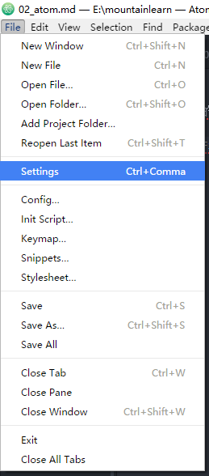
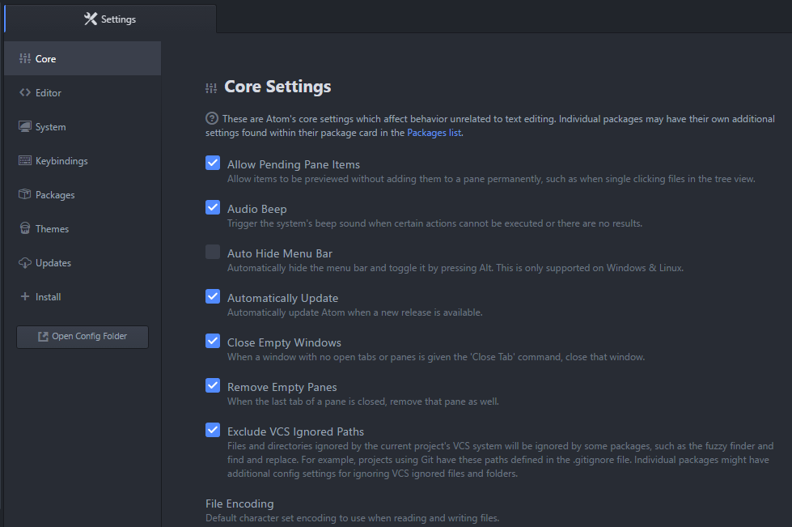
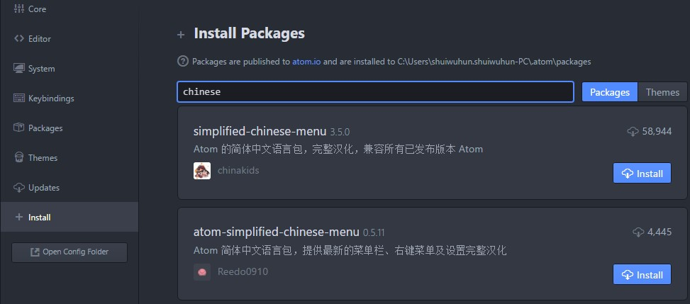

# Atom  
[1、菜单栏](#菜单栏)  
[2、设置中心](#设置中心)  
[3、常用快捷键](#常用快捷键)  
[4、插件推荐](#插件推荐)  
[5、汉化](#汉化)  

## 菜单栏  
- File — 文件的保存打开,项目的保存打开,最后一次的项目加载,关闭及设置中心,以及用户自定义的配置(配置文件,初始化脚本,样式风格,代码片段,快捷键配置文件)等；
- Edit — 文件编辑的操作,文件编码格式,及行跳转等；
- View — 重载页面,全屏,字体大小的缩放等；
- Find — 都是关于查询的 ,跟 Sublime text 极其相似,快捷键基本一样；
- Package — 包,就是插件列表的集合点；
- Help — 帮助文档,软件更新,协议等。  

## 设置中心  
  

点击【File】=>【Settings】进入设置中心。1.12.9版本的atom的设置中心分为8个部分：

- Core —— 全局设置，可以设置文件的编码，菜单栏是否显示，忽略文件，文档缩进，字体大小，项目主目录等；

- Editor —— 编辑器设置，可以设置编辑器的字体、不可见元素、段落格式等；

- System —— 主要是设置集成到系统右键菜单的功能的；

- Keybindings —— 快捷键配置，默认快捷键都汇总于此了，很方便查询对应的快捷键的功能,也方便修改；

- Packages —— 插件管理中心，可以设置插件，删除插件及禁用，无安装功能；

- Themes —— 主题管理中心，可以设置主题(支持鼠标选定,也支持写入配置文件生效)，管理主题(删除及在线下载主题)；

- Updates —— 目前功能只有一个，查询社区包的状态,随时随地的更新已安装的插件，Atom 软件的更新在 HELP 里面；

- Install —— 目前分为两栏，自上而下，第一部分是搜索(可以搜索社区的插件)，下面一部分会展示目前比较流行的插件(可以直接点击下载使用)。  

  

- Open Config Folder —— atom软件的配置文件集合目录。

最后这个是打开atom配置目录的，配置文件后缀是cson，类似JSON。双击目录中的文件可以编辑。  

[回到顶部](#atom)  

## 常用快捷键  
|英文|中文|快捷键|
|:----|:-----|:----|
|New Window|新建窗口|Ctrl+Shift+N|
|New File|新建文件|Ctrl+N|
|Open File|打开文件|Ctrl+O|
|Open Folder|打开文件夹|Ctrl+Shift+O|
|Add Project Folder|加载项目目录|Ctrl+Alt+O|
|Reopen Last Item|重新加载上次项目|Ctrl+Shift+T|
|Save|保存文件|Ctrl+Shift+T|
|Save As|另存为|Ctrl + Shift +S|
|Close Tab|关闭当前编辑文档|Ctrl + W|
|Close Window|关闭编辑器|Ctrl + Shift + W|
|Undo|撤销|Ctrl + Z|
|Redo|重做|Ctrl + Y|
|Cut|剪切|Shift + Delete|
|Copy|复制|Ctrl + Insert|
|Copy Path|复制文档路径|Ctrl + Shift + C|
|Paste|粘贴|Shift + Insert|
|Select All|全选|Ctrl + A|
|Select Encoding|选择编码|Ctrl + Shift +U|
|Go to Line|跳转到某行|Ctrl + G|
|Slect Grammar|语法选择|Ctrl + Shift + L|
|Reload|重载|Ctrl+ Alt +R|
|Toggle Full Screen|F11|全屏|
|Increase Font Size|增大字体|Ctrl + Shift + “+”|
|Decrease Font Size|减小字体|Ctrl + Shift + “-“|
|Toggle Tree View|展示隐藏目录树|Ctrl + \|
|Toggle Commadn palette|全局搜索面板|Ctrl + Shift + P|
|Markdown Preview|Markdown预览|Ctrl+Shift+M|
|Select Line|选定一行|Ctrl + L|
|Select First Character of Line|选定光标至行首|Shift + Home|
|Slect End of Line|选定光标至行尾|Shift + End|
|Select to Top|选定光标处至文档首行|Ctrl + Shift + Home|
|Select to Bottom|选定光标处至文档尾行|Ctrl + Shfit + End|
|Find in Buffer|从缓存器搜索|Ctrl + F|
|Replace in Buffer|高级替换|Ctrl + Shift + F|
|Select Next|匹配选定下一个|Ctrl + D|
|Select All|匹配选定所有|Alt + F3|
|Find File|查询文件,选定打开|Ctrl + P|
|Delte End of Word|删除光标处至词尾|Ctrl + Del|
|Duplicate Line|复制增加当前行|Ctrl + Shift + D|
|Delete Line|删除一行|Ctrl + Shift + K|
|Toggle Comment|启用注释|Ctrl + /|
|Toggle developer tools|打开Chrome调试器|Ctrl + Alt + I|
|Indent|增加缩进|Ctrl + [|
|Outdent|减少缩进|Ctrl + ]|
|Move Line Up|行向上移动|Ctrl + up|
|Move Line Down|行向下移动|Ctrl + Down|
|Join Lines|行链接|Ctrl + J|
|newline-below|光标之下增加一行|Ctrl + Enter|
|editor:newline-above|光标之上增加一行|Ctrl + Shift + Enter|
|pane:show-next-item|切换编辑的标签页|Ctrl + Tab|
|Fuzzy Finder|文件跳转面板|Ctrl + T|
|Select Line Move above|选中行上移|Ctrl + up|
|Select Line Move below|选中行下移|Ctrl + down|
|Symbol-view|进入变量、函数跳转面板|Ctrl + R|  

[回到顶部](#atom)  

## 插件推荐

插件可以实现强大的功能，但是插件多了之后会容易引起快捷键冲突，所以建议大家可以根据自己的专业需求，选择几个优质的插件装上就可以了。这里推荐几个是对web前端比较好的插件。

### Emmet  

这个插件功能非常强大，可以节约大量HTML/CSS代码编写的时间，它使用仿CSS选择器的语法来生成代码。

### minimap  

sublime上有个很实用的小功能，就是在编辑代码的时候，边上会有个小的代码图，这个插件就是为Atom加上这个功能的。

### color-picker  

取色器  

### linter  

这个插件可以识别多门语言的错误，可以细分很多针对某种语言版本的，适合前端的主要有：
- linter-jshint
- linter-csslint  
- linter-scss-lint  
- linter-less  
- linter-pylint  
- linter-php   

[回到顶部](#atom)  

## 汉化  
英语不太好的人，当然要用中文的会顺手一些，atom没有中文版，但是可以通过插件来汉化。  

选择【File】-【Settings】-【Install】然后搜索要安装的扩展，模糊搜索“chinese”就可以找到汉化的插件，会有多个结果，建议选择安装次数最多的插件，然后点“install”安装。  

安装完成之后atom里的菜单、设置等就会编程中文显示的。  

后续需要管理或删除这个插件的时候可以到设置的【Packages】或【插件】里操作。  

